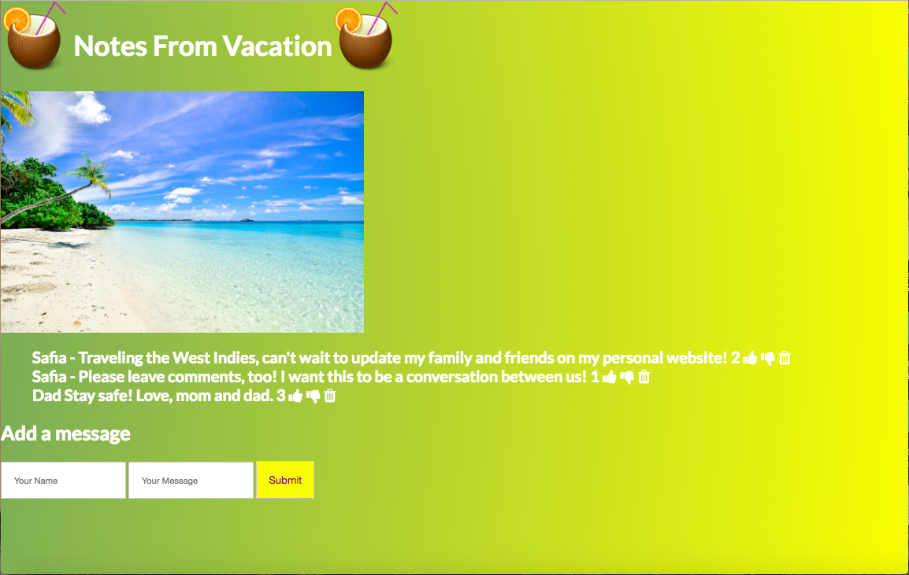

# FULL-STACK-Vacation-Express
An application where family members can check up on one another while on vacation.

## How It's Made:
**Tech used:** HTML, CSS, JavaScript, Mongo DB, Express.js, Node.js

Users can log onto the page, where they use the inputs to send messages, which are saved onto a database. They can also react to each message, also saved onto the database. 

## Lessons Learned:
I learned how to develop server side code to deliver the application and save messages to Mongo DB.

## Examples:
Take a look at these couple examples that I have in my own portfolio:

**Vacation-app:** https://github.com/aliaabdulahi/FULL-STACK-Vacation-Express

**Kanye-west-app:** https://github.com/aliaabdulahi/Kanye-ExFans-Express

**Instagram-api-oauth:** https://github.com/aliaabdulahi/instagram-API-OAuth
